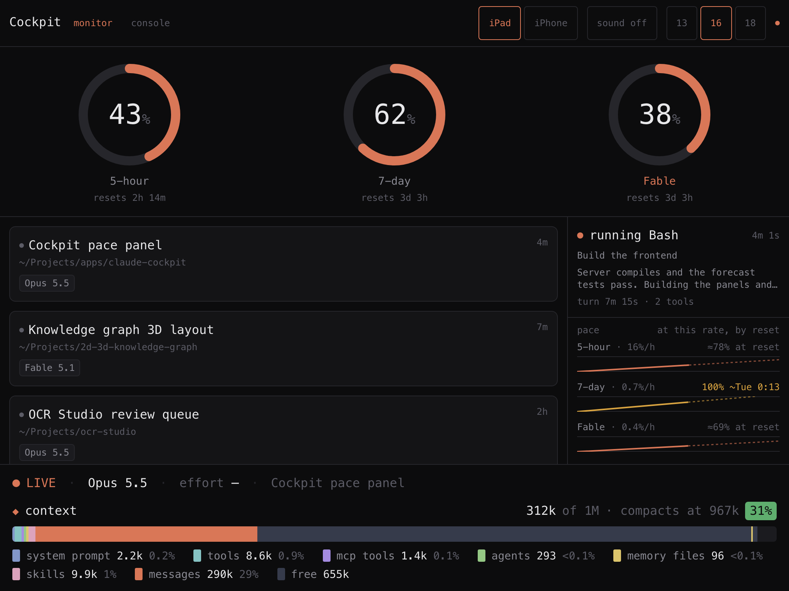
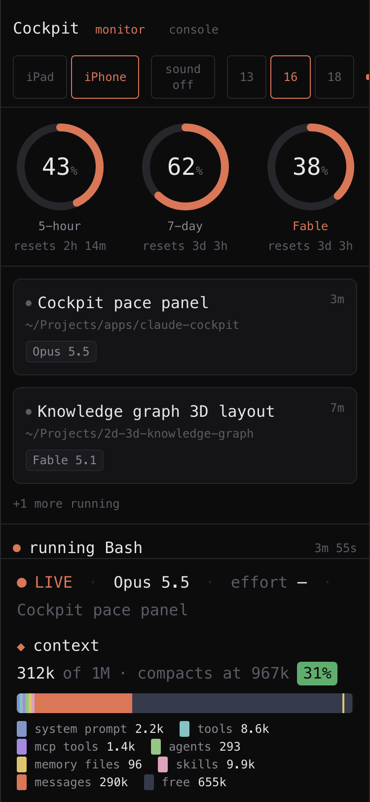

# Claude Cockpit


**A wall-mounted status board for [Claude Code](https://claude.com/claude-code).**
Runs on a spare iPad or iPhone next to your desk and shows — at a glance — how much
of your usage limits you've burned, what your live sessions are doing, and whether
you're about to hit a wall. It can also *drive* Claude Code sessions, not just
watch them.



<p align="center">
  
</p>

<p align="center">
  <em>One board, two layouts — landscape on the iPad, portrait on the phone.</em>
</p>

> Built to run on a **2015 iPad Mini 4** (iPadOS 15, Safari 15) sitting beside a
> desktop monitor, with a portrait layout for an **iPhone 11**. Most of the
> non-obvious engineering choices exist to make a modern dashboard render cleanly
> on that decade-old browser.

---

## What it shows

The **monitor** view is a read-only glance board:

- **Usage gauges** — your rolling **5-hour** and **7-day** plan limits, plus a
  model-scoped **Fable** gauge, each with a live reset countdown. Turn amber as
  you approach the ceiling.
- **Live sessions** — every running Claude Code session (including ones started
  by the desktop app), with its model and state.
- **Now** — what the focused session is doing this second: `running Bash`,
  `thinking`, `needs approval` or `idle`, with what the tool is acting on (the
  command, file, pattern…), the last thing Claude wrote, how long the turn has
  run, and how many tools it has called.
- **Pace** — for each plan limit, a sparkline of usage across its window with
  a dashed projection to reset, and the verdict: *≈19% at reset*, or — in
  amber — *100% ~Wed 1:07 AM* if you'll run out first.
- **Status footer** — a persistent `LIVE / OFFLINE` indicator, the focused
  session's model, effort and title, and a full-width segmented **context** bar
  in the style of the CLI's own readout: system prompt, tools, MCP tools,
  agents, memory files, skills and messages, each with its share, plus free
  space and a marker where auto-compaction kicks in.

The **console** view turns it into a remote control:

- Spawn a Claude Code session the dashboard owns, and prompt it from the tablet.
- Switch **model** live, change **effort** (preserving the conversation),
  interrupt, or close.
- **Approve or deny tool calls** from the iPad when a session needs permission.

### Two layouts, one switch

A control in the header toggles between the two device layouts. It defaults to
whichever matches the viewport's aspect ratio — so a phone lands on portrait and a
tablet on landscape — then remembers your choice.

| | iPad (landscape) | iPhone (portrait) |
|---|---|---|
| Gauges | full size, in a row | smaller, three across |
| Body | sessions ∣ now + pace, side by side | stacked: sessions, now, pace |
| Sessions | all of them | the 2 most recent, to keep the column short |
| Width | fills the screen | a phone-width column, centred on wider screens |

Both respect the iOS safe-area insets, so the header clears the notch and the
footer clears the home indicator.

---

## Tech stack

| Layer | Choice | Why |
|---|---|---|
| Frontend | **React 18 + TypeScript**, built with **Vite 5** | Fast dev loop; small self-contained bundle (~50 KB gzipped). |
| Styling | **Tailwind CSS v3** | **Not v4** — v4 requires Safari 16.4 and would render unstyled on the iPad Mini 4. This pin is load-bearing. |
| Backend | **Fastify 5** + **`ws`** (WebSocket) | A long-lived process that tails files, watches sessions, and pushes updates — the opposite grain to a request/response framework like Next.js. |
| File watching | **chokidar** | Watches `~/.claude` for session and transcript changes. |
| Runtime | **Node.js** via **tsx** (run TypeScript directly) | No separate build step for the server. |
| Process mgmt | **launchd** (macOS LaunchAgent) | Auto-start at login, restart on crash, survive reboots. |
| Transport | One WebSocket, updates **coalesced to 250 ms** | The iPad's 2015 A8 chip (2 GB RAM) would choke on a socket firing per token. |

Everything is served on **one port (5200)** in production — the Vite-built SPA and
the API/WebSocket share the same Fastify server.

---

## How it works

Claude Cockpit reads local state that Claude Code already writes to `~/.claude`,
and (optionally) drives new sessions it spawns itself. There are two planes:

### Observe plane (read-only, works for every session)

- **Session registry** — watches `~/.claude/sessions/*.json` for live sessions
  (pid, cwd, model, version), confirming liveness with a `process.kill(pid, 0)`.
- **Transcript tailer** — incrementally tails
  `~/.claude/projects/**/<id>.jsonl` from a byte offset and reads the newest
  assistant turn for model + token usage. Sub-agent turns are skipped so context
  reflects the main thread.
- **Plan usage** — fetches your limits from the Claude usage API using the OAuth
  token in your macOS Keychain, and **auto-refreshes** it so the panel never goes
  stale (see Design notes).
- **Activity** — busy/idle comes from the `status` field Claude Code keeps in
  each session's registry file (its timestamp marks when the turn began); the
  current tool, its target and the latest prose come from the transcript
  tail, matching each `tool_use` to its `tool_result`.
- **Pace** — every successful usage poll is recorded per limit, per window,
  in `.cockpit-usage.json`, so history survives restarts. The forecast uses
  the slope over the last hour (5-hour limit) or day (weekly), and falls back
  to the average since the window opened — which needs no history at all,
  since every window starts at 0%. The last good reading is also replayed at
  startup, so the gauges don't blank while the first poll is in flight.
- **Context window** — the current context vs. the model's real window, pulled
  live from the Models API (`max_input_tokens`), not a hardcoded number.
- **Context breakdown** — Claude Code never writes its per-category estimate to
  disk, so the server asks the CLI: `claude -p /context` in the session's cwd,
  with the session's own entrypoint, reports the fixed overhead (system prompt,
  tools, skills, memory, agents) without making an API call. Cached per
  cwd + entrypoint for 15 minutes.
  *Messages* is the real token count from the transcript minus that overhead.

### Control plane (drives sessions the app owns)

Desktop sessions are owned by the Claude Code app over stdio pipes and can't be
driven from outside — so the console view **spawns its own** sessions via
`claude -p --input-format stream-json --output-format stream-json` and owns the
process. Those sessions can be prompted, switched, and gated for permission, and
they also show up on the monitor like any other session.

### Notifications

A set of Claude Code **hooks** (`Notification`, `Stop`, `UserPromptSubmit`) POST
to the server, which drives the "needs you" indicators and an in-page sound
alert. (Web Push isn't available on Safari 15, so alerts are
in-page.)

---

## Getting started

**Prerequisites:** macOS, Node.js 20+, [pnpm](https://pnpm.io), and Claude Code
installed. The usage panel needs a one-time `claude auth login`.

```sh
pnpm install
pnpm dev            # Vite on :5199, API + WebSocket on :5200
```

Open the URL the server prints (it includes an access token):

```
http://<your-mac-ip>:5200/?t=<token>
```

On the iPad, open that URL once in Safari, then **Share → Add to Home Screen** for
a fullscreen kiosk. Set **Auto-Lock → Never** and keep it charging.

### Run it permanently (macOS)

Installed as a per-user LaunchAgent — starts at login, restarts on crash, survives
reboots. Production build, everything on **:5200**. `service/install.sh` generates
the plist with absolute paths for your checkout and loads it.

```sh
pnpm build
sh service/install.sh
```

| Task | Command |
|---|---|
| Restart (after `pnpm build`) | `launchctl kickstart -k gui/$(id -u)/com.cockpit.server` |
| Stop | `launchctl bootout gui/$(id -u)/com.cockpit.server` |
| Logs | `tail -f service/cockpit.log` |

---

## Project structure

```
server/            Fastify + WebSocket backend (TypeScript, run via tsx)
  hub.ts             aggregates all state, coalesces updates, broadcasts
  sessions.ts        watches ~/.claude/sessions registry
  transcript.ts      incremental JSONL tailer for model + token usage
  limits.ts          plan-usage gauges (5h / 7d / Fable), history and pace forecast
  credential.ts      Keychain read + self-refreshing OAuth token
  models.ts          live context-window sizes from the Models API
  context.ts         per-cwd `claude -p /context` probe → context breakdown
  agent.ts / agents.ts   spawns and drives owned Claude Code sessions
  permissions.ts     holds tool calls for iPad approval
  index.ts           HTTP/WS server, token gate, control endpoints

src/               React + Tailwind frontend
  App.tsx            layout + view switching
  components/        LimitsHero, NowPanel, PacePanel, StatusBar, ContextBar, …
  ws.ts              WebSocket hook + shared types

hooks/             Claude Code hooks that POST to the server
  notify.mjs         Notification / Stop / UserPromptSubmit → attention state
  permission.mjs     PreToolUse → iPad allow/deny

service/           launchd launcher (run.sh) + logs
```

---

## Design notes

The interesting decisions, most of them forced by the Safari 15 target or by how
Claude Code actually behaves (each verified against the real CLI, not assumed):

- **Tailwind v3, not v4.** v4 needs Safari 16.4; the iPad Mini 4 tops out at
  iPadOS 15.8. Vite's `build.target` is pinned to `['es2020','safari15']` too.
- **Touch targets are 44 px in absolute pixels, not `rem`.** A fingertip doesn't
  scale with the font-size control, and a density-scaled button was untappable.
- **Updates coalesce at 250 ms** and the DOM is capped — the 2015 A8 can't take a
  socket firing on every token.
- **The usage token self-refreshes.** Its TTL is 8 h and the refresh token
  *rotates* on every use, so the app writes the new token back to the shared
  Keychain (an app-private copy would log out whichever party — app or CLI —
  refreshed second). The Keychain entry also holds unrelated MCP tokens, so
  write-back merges only the account fields.
- **Context windows are fetched, never hardcoded.** Nearly every current model is
  **1M** tokens, not 200k — hardcoding 200k under-reported Opus by 5×.
- **The context breakdown is a probe, not a parse.** The category split lives
  only inside the CLI process, so the server runs `claude -p /context` per cwd
  (about a second, no API call) and deletes the empty transcript it leaves
  behind. The entrypoint matters: under launchd's bare environment the CLI
  defers every system tool and the *tools* row vanishes; run as
  `claude-desktop` it matches the app's own panel. Whatever the estimate
  misses lands in *messages*, so the total always matches the real count.
- **Effort can't be changed live** (`set_model` works as a control request but
  `set_effort` doesn't exist), so the effort control restarts the session with
  `--resume`, which preserves the conversation.
- **Permission approval rides on a `PreToolUse` hook**, not `can_use_tool` —
  which never fires in `-p` mode. Returning `permissionDecision: allow` overrides
  the CLI's silent auto-deny.
- **Fail-safe hooks.** The notification and permission hooks run on every turn, so
  every failure path (server down, bad JSON) exits cleanly and defers to Claude
  Code's normal behavior — they never block a session or fabricate an approval.

---

## Limitations

- **macOS only** — the usage token lives in the macOS Keychain and the service is
  a launchd agent. Ports would be needed for Linux/Windows.
- **Effort shows `—` on the monitor** for desktop sessions — it's set at spawn and
  never written to disk, so an observer genuinely can't know it. It's live in the
  console (where the app chose it).
- **The Mac must be awake and on the LAN** for the iPad to reach it.

---

## License

[MIT](LICENSE) © Hung Ngo

Not affiliated with Anthropic. It reads local files Claude Code writes and calls
the same undocumented endpoints the CLI uses — those can change without notice.
Use at your own risk.
